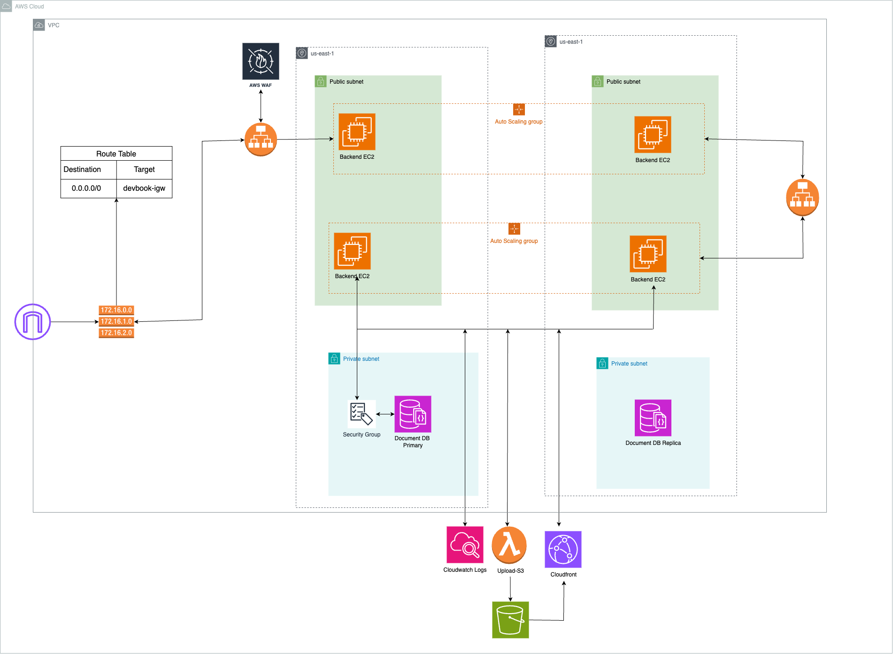

### DevBook

## Introduction

I have took opensource MERN stack project from [here](https://github.com/Mugilan-Codes/dev-book), and design the cloud architecture to host the application on AWS with best practices and well architect framework.

## AWS Services 

| Category | Services |
|---|---|
| Compute | EC2, EC2 Auto Scaling, Lambda |
| Storage | S3 |
| Database | DocumentDB |
| Network & Content Delivery | VPC, Elastic Load Balancing, Cloudfront |
| Management and Governance | Cloudwatch |
| Security, identity, and compliance | WAF, Secret Manager |

## AWS Architecture

## Application Flow : 

### VPC :
- When a user hits the browser it will go through VPC (isolated
network), it will allow access from the internet via internet gateway to
public subnet only.

### Frontend EC2 :
- EC2 in the public subnet (us-east-1a) will have a running react js
app, which will be accessible from the internet.
- The user will receive a running DevBook web application.

### Launch Template :
- Launch template contains user data script for running backend node
app, and this will be there in Auto scaling group.

### Load balancer :

- Load balancer will receive traffic from frontend ec2, and forward it to
a healthy running backend instance, and return business response
from node to react frontend.

### Cloudwatch :
- All the backend logs will be triggered in cloudwatch.

### S3 :
- When a user updates a profile image, the updated image will be
stored in S3, and fetched with cloudfront.

### Secret Manager :
- Storing crucial information like database credentials, and accessing
from node js backend.

### Auto scaling group :
- Auto scaling groups will automatically scale EC2 instances if a
health check fails

## AWS Well-Architected Framework : 

### Perform Operation as Code :
- **Infrastructure as Code (IaC)**: Application has written Infrastructure
with AWS cloudformation to define whole architecture ensures that
infrastructure is managed as code.
- This approach allows for consistent, repeatable deployments and
automated management of infrastructure changes, reducing
manual intervention and errors.
- [Cloudformation Link](./cloudformation.yaml)

### Monitoring and Logging :
- It allows for **real-time monitoring** of application performance and
helps in **troubleshooting issues** quickly.
- We can enable services such as CloudWatch for monitoring our application and logging the crucial data.
- **Storing logs** for Node.js EC2 instances in CloudWatch enables centralized log management and monitoring.
- This allows for **real-time insights** into application performance and operational health facilitating **quicker issue detection** and resolution.
- We have integrated cloudwatch agent in our backend launch template and enable logging from file : **/var/log/messages**

### Security pillar :

### Apply security at all layers :
- We have used WAF (Web application Firewall) for enhancing security , and attached it with our load balancer.
- This will provide protection against web exploits.
- WAF is connected with Load balancer

### Infrastructure protection :
- Infrastructure protection encompasses control methodologies, such as defense, necessary to meet best practices.
- For protecting our infrastructure we should add VPC to create a private subnet, which will be : secured, and a scalable environment in which we can define our topology—including gateways, routing tables, and public and private subnets
- In DevBook we have VPC, with a public and private subnet, and a
private subnet containing DocumentDB..
- Security group of DocumentDB, which is in a private subnet : only
allows inbound rule from security group of load balancer : all
others will be rejected.

### Keep People Away from Data :
- Using cloudfront Origin Access Identity (OAI), we are restricting s3
bucket to direct access from people.
- This will serve user profile images globally, without losing security

## Reliability Pillar

### High Availability & Fault tolerance
- Our backend EC2 instance is in Auto scaling group with a load balancer in a public subnet (us-east-1a and us-east-1b) ensuring high availability.

### Auto Scaling: 
- Ensures that the backend EC2 instances scale in and out based on demand, maintaining application performance and availability even if some instances fail.
- The auto-scaling group automatically replaces unhealthy instances, reducing the impact of instance failures.
- Auto scaling has 1 as desired capacity and 2 as maximum capacity, this means that, by default only one EC2 instance will be running with node JS app in port 8080, and in case of health check fails, it will automatically create a new EC2 instance with the help of launch template.

### Load Balancer: 
- Distributes traffic across multiple backend instances to ensure that the application remains available even if some instances become unavailable.

## Performance Efficiency Pillar :
### Right-Sizing :
- EC2 Instances: Architecture uses EC2 instances for the frontend and backend. With Auto Scaling, we can dynamically adjust the number and size of instances based on traffic and workload, ensuring that we are using the appropriate instance types and sizes for your application’s needs.
- So, by utilizing Auto scaling we are able to right size the EC2
instances.
### Democratize advanced technologies :
- Using Managed and advanced AWS services such as
DocumentDB, offloads the complexity of database management, including backups, patching, and scaling, allowing US to focus on application development.
- ELB and cloudfront are used to handle complex tasks of load balancing and content delivery, respectively, without the need for deep expertise in these areas.
### Go global in minutes:
- CloudFront: By using CloudFront as a CDN, the architecture can
deliver content to users worldwide with low latency, improving the
global performance of the application.
- Multi-AZ Deployment: The use of Auto Scaling groups implies a
multi-AZ deployment, providing regional resilience and consistent
performance across different geographical areas
